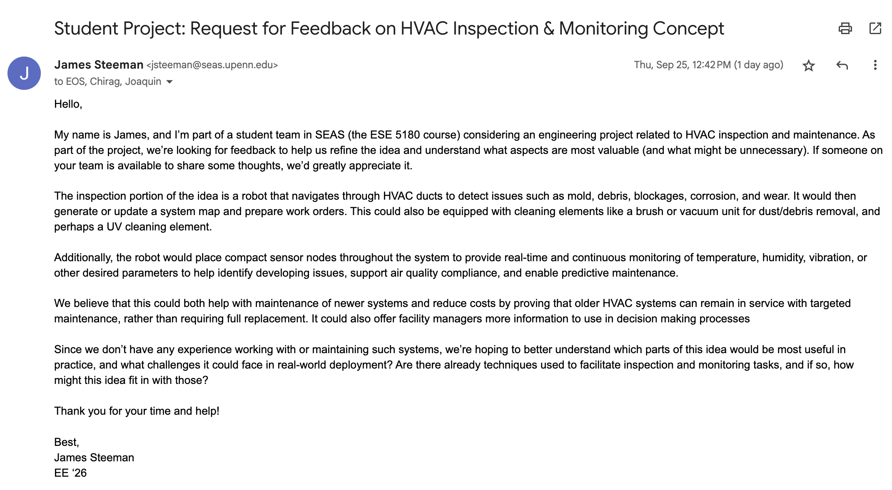
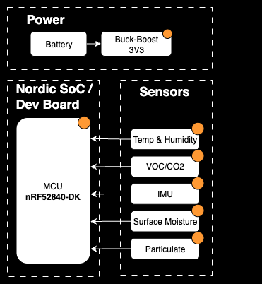
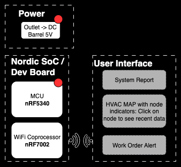
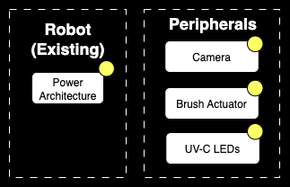
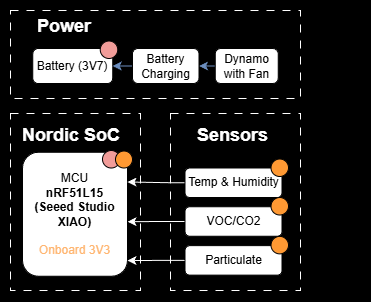
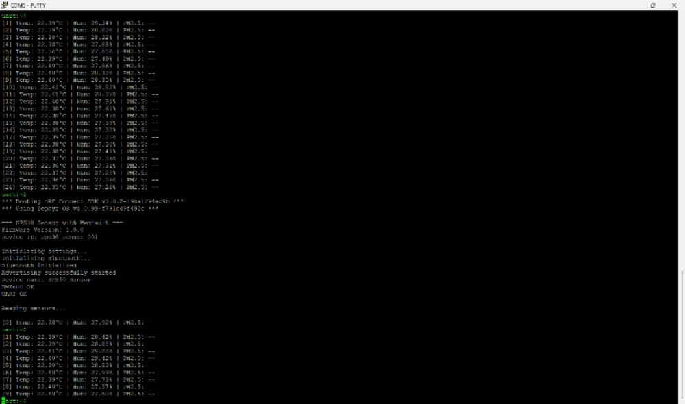
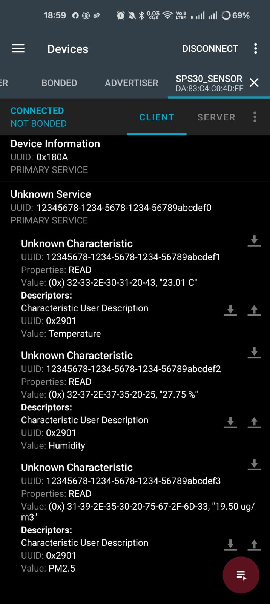
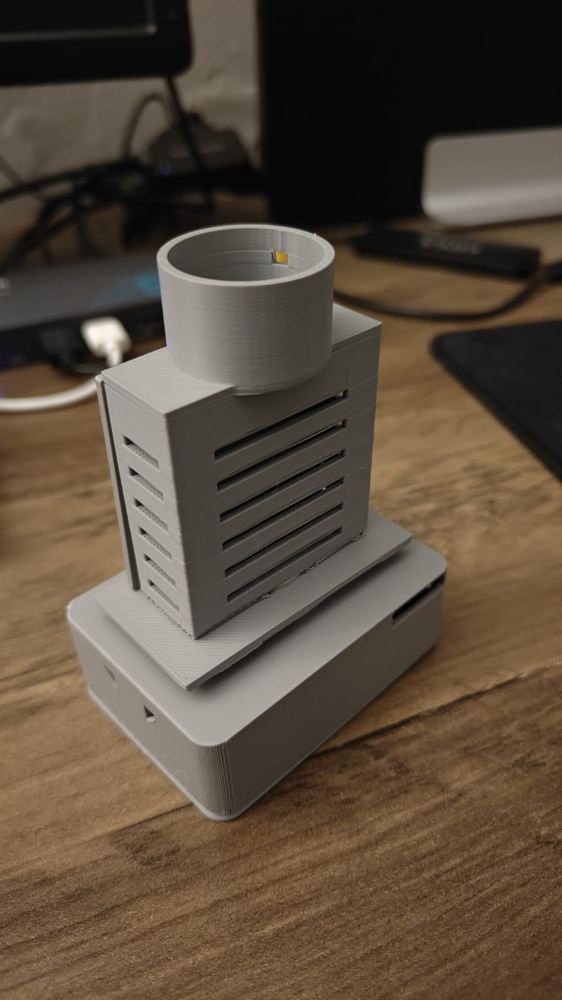

# IoT Venture Pitch

## ESE5180: IoT Wireless, Security, & Scaling

**Team Name:** Gatorade

| Team Member Name | Email Address       |
|------------------|---------------------|
| James Steeman | [jsteeman@seas.upenn.edu](jsteeman@seas.upenn.edu) |
| Joaquin Revello Lerena | [joaquinr@seas.upenn.edu](joaquinr@seas.upenn.edu) |
| Chirag Satapathy | [csat28@seas.upenn.edu](csat28@seas.upenn.edu) |

**Weekly Meeting:** Wednesday 7pm

**GitHub Repository URL:** [https://github.com/ese5180/iot-venture-f25-gatorade](https://github.com/ese5180/iot-venture-f25-gatorade)

## Concept Development

### Product Function

Our smart HVAC system will integrate permanent sensors at key nodes throughout ductwork to continuously monitor air quality, VOC, humidity, then alert operators to deploy an AI-guided mobile robot for chemical-free cleaning using UV-C sterilization and adaptive brushing to achieve 99.99% pathogen elimination. The sensor network will predict contamination issues and guide operators to exact problem locations, while the lightweight bot will provide superior cleaning results in 30 minutes versus 2-3 hours for competitors. This intelligent system will deliver better performance at lower cost by combining continuous monitoring with smart operator guidance for targeted, efficient cleaning.

### Target Market & Demographics

**Who will be using your product?**

- Facility managers at commercial buildings (offices, hospitals, schools, retail)
- HVAC technicians who will operate the AI-guided cleaning bot
- Building maintenance staff monitoring the sensor network dashboard
- Property managers overseeing multiple buildings

**Who will be purchasing your product?**

- Commercial building owners (office buildings, shopping centers, hotels)
- Healthcare facility administrators (hospitals, clinics, care facilities)
- Educational institutions (universities, school districts)
- Property management companies managing multiple commercial properties
- Data center operators requiring precise environmental control

**Where in the world would you deploy your product?**

- Primary markets: North America (US, Canada) - strict indoor air quality regulations
- Secondary markets: Europe (UK, Germany, Nordic countries) - high environmental standards
- Growth markets: Australia, Japan, Singapore - advanced building management adoption
- Future expansion: Major commercial centers in developing markets (Dubai, Hong Kong, major Chinese cities)

**How large is the market you're targeting?**

- Global HVAC services market: ~$200 billion annually
- Building management systems: ~$20 billion annually
- Indoor air quality monitoring: ~$5 billion annually growing 8%+ yearly
- Serviceable addressable market: ~$15-25 billion (commercial buildings with centralized HVAC)

- Target segment (50,000+ sq ft commercial): ~$8-12 billion annually

**How much of that market do you expect to capture?**

- Year 1-2: 0.01% = $1-2 million (pilot customers, proof of concept)
- Year 3-5: 0.1% = $10-25 million (regional expansion, established product)
- Year 5-10: 1-2% = $100-250 million (national presence, market leadership)
- Long-term potential: 5-10% = $500M-$1.2B (dominant platform with international expansion)

**What competitors are already in the space?**

Direct Competitors

- Teinnova Multibot - Professional duct cleaning robots ($50K+ equipment)
- JettyRobot S - Industrial pipeline inspection/maintenance ($100K+ systems)

Indirect Competitors

- Traditional HVAC cleaning services - Manual cleaning companies
- Smart building management systems - Johnson Controls, Honeywell, Siemens
- Indoor air quality monitors - Airthings, PurpleAir, Awair
- Smart HVAC filters - 3M Filtrete, Nordic Pure smart filters

#### Key Differentiation

No existing competitor combines continuous sensor monitoring with AI-guided mobile cleaning and chemical-free UV-C sterilization in a comprehensive building health management platform.

### Stakeholders

We have reached out to several stakeholders, including emailing EOS at UPenn, and submitting web contact forms for LG and Hitachi, but have not solidified any individual stakeholder at this point.

Since we believe the current idea of our product will be more directed towards HVAC companies and building managment than maintenance staff, we continuing to reach out to additional companies (through sales departments) for feedback on our idea.

### System-Level Diagrams

#### Sensor Node

#### Gateway

#### Robot

We will start by leveraging an existing robot and prototyping on top/hacking the robot to add cleaning functionality. Below is a very simple diagram indicating our added peripherals, which we will first attempt to power from the robot's power architecture, but add external battery/power management if necessary.

### Security Requirements Specification

#### Security Overview

The system will ensure data, communications, and firmware integrity are protected from tampering, eavesdropping, and unauthorized access. Security measures particularly focus on safeguarding the gateway and nodes, which are in continuous operation and not always being observed.

#### Security Definitions, Abbreviations

- OTA: Over the air firmware updates
- GUI: Graphic User Interface

#### Security Functionality

| Requirement ID | Requirement Title | Description | Rationale |
|----------------|-------------------|-------------|-----------|
| SEC 01 | Gateway Firmware Integrity | Gateway shall run only firmware from signed OTA updates, and shall securely store keys | The gateway acts as a bridge between the sensor node mesh network and the cloud (data portal etc.), and compromise here could expose the client's network and leave them vulnerable to attacks and breaches |
| SEC 02 | Autheticate Nodes | Each sensor node shall authenticate in the mesh network using unique key/certification and ignore messages from tampered systems | This prevents unauthorized devices from disrupting the mesh or tampering with the data at the hardware level. It also protects from counterfit devices being added to our network |
| SEC 03 | Data Encryption | Communication from nodes, gateway and GUI interface shall be encrypted | This protects potentially sensitive IAQ and predictive maintenance data from eavesdropping and tampering at the data level |

### Hardware Requirements Specification

#### Hardware Overview

The system contains a mobile robot for HVAC navigation, duct cleaning operations and sensor node depolyment. Low power sensor nodes will be deployed in the HVAC system for data collection to identify system issues and enable predictive mainenance. There will also be a gateway node.

#### Hardware Definitions, Abbreviations

- HVAC: Heating, Ventilation, and Air Conditioning
- VOCs: Volatile Organic Compounds
- UV-C: Ultraviolet C - short-wavelength UV light used for chemical-free disinfection and sterilization

#### Hardware Functionality

| Requirement ID | Requirement Title | Description | Rationale |
|----------------|-------------------|-------------|-----------|
| HRS 01 | Bot Size and Weight | The mobile bot shall be maximum 300mm x 100mm x 100mm (can change) and weigh less than 5kg to fit through standard commercial ductwork. | Must navigate existing HVAC systems without modifications or damage. |
| HRS 02 | UV-C Sterilization | The bot shall include UV-C LEDs with 360-degree coverage to achieve 99.99% pathogen elimination. | UV-C sterilization is the core technology differentiator for chemical-free cleaning. |
| HRS 03 | Sensor Durability | Sensor nodes shall operate in -10°C to +70°C, 0-95% humidity with IP65 protection, VOC and 12+ month battery life. | HVAC environments are harsh; sensors must survive without frequent maintenance. |
| HRS 04 | Wireless Communication | System shall maintain mesh networking with 100m range and <2 second response time between sensors and bot. | Real-time monitoring and response is critical for building health management. |
| HRS 05 | Camera System | The bot shall include HD cameras with LED illumination for visual inspection and AI-powered contamination detection in low-light ductwork environments. | Visual documentation and AI analysis are essential for contamination identification and compliance reporting. |

### Software Requirements Specification

#### Software Overview

The node/gateway software shall collect, process, and transmit sensor data HVAC sensor nodes to a centralized gateway. It shall manage sensor feature toggling, battery optimization, and secure communications across BLE mesh and Wi-Fi networks.

The robot software shall collect and process real time controls and data for navitagion and cleaning operations.

#### Software Users

- Facility managers at commercial buildings (offices, hospitals, schools, retail) using IoT dashboard
- HVAC technicians operating cleaning robot
- Building maintenance staff monitoring the IoT dashboard
- Property manager

#### Software Abbreviations

- MCU: Microcontroller Unit

#### Software Functionality

| Requirement ID | Requirement Title | Description | Rationale |
|----------------|-------------------|-------------|-----------|
| SRS 01 | Battery Optimization | Software shall use MCU low power modes, intermmittent sensing and transmission to extend battery life to at least one year | It is important to maximize sensor lifetime to minimize disruptions and maintenance on the network |
| SRS 02 | Robot Deployment/Guidance | IoT dashboard shall alert operators to provide precise contamination or fault locations for targeted cleaning/work orders | Reduces manual inspection time and system downtime |

## Pitch 1

[Course Pitch 1 Slides](https://docs.google.com/presentation/d/1BxViGAQksIzPptYEwyB8goSnDLoXB-iTrtr7Zekc3ss/edit?usp=sharing)

## Wireless Demo

[Gateway Repo](https://github.com/ese5180/t06_gatorade-gateway)

[Mesh Node Repo](https://github.com/ese5180/t06_gatorade-mesh_node)

We have pulled and compiled the code on the different machines.

We have ordered sensors and the seeed studio XIAO nRF54L15 (s) for our ble mesh nodes.

## Concept Refinement

### Concept Review & Refresh

#### Description

Our smart HVAC system integrates permanent sensor nodes throughout ductwork to continuously monitor air quality, VOCs, and humidity. Each node uses force air power generation to recharge its battery, enabling long-term autonomous operation. When contamination is detected, operators are alerted to deploy a mobile cleaning unit that uses UV-C sterilization and adaptive brushing to achieve pathogen elimination. The system predicts issues, pinpoints problem areas, and delivers superior cleaning in less time versus 2–3 hours for competitors—offering continuous monitoring and targeted, efficient cleaning at lower cost.

#### Product Function

Our proposed solution is an integrated smart HVAC management system to continuously monitor HVAC system health using distributed sensor nodes and maintain the system with deployable guided cleaning robots. The network of permanent sensors embedded in ductwork measures VOC levels, humidity, and particulate contamination in real time, transmitting data to a central dashboard, from which operators can make data driven decisions. If abnormal readings are detected, the system provides alerts and guidance. The compact mobile cleaning robot is equipped with UV-C sterilization lamps and adaptive brushes to disinfect and remove buildup without chemicals while navigating autonomously through ducts. By combining predictive analytics from the sensor network with targeted robotic cleaning, the system transforms HVAC maintenance from a reactive to a proactive process. Facility managers can visualize air quality trends, schedule cleanings efficiently, and verify cleanliness with post-cleaning validation data. The chemical-free, automated process not only improves IAQ and system performance but also reduces operational costs and downtime. This integrated approach is a scalable, eco-friendly, and data-driven solution meeting modern building health and sustainability standards while offering a ROI through reduced maintenance time and energy savings.

#### Target Market & Demographics

**Who will be using your product?**

- Facility managers at commercial buildings (offices, hospitals, schools, retail)
- HVAC technicians who will operate the AI-guided cleaning bot
- Building maintenance staff monitoring the sensor network dashboard
- Property managers overseeing multiple buildings

**Who will be purchasing your product?**

- Commercial building owners (office buildings, shopping centers, hotels)
- Healthcare facility administrators (hospitals, clinics, care facilities)
- Educational institutions (universities, school districts)
- Property management companies managing multiple commercial properties
- Data center operators requiring precise environmental control

**Where in the world would you deploy your product?**

- Primary markets: North America (US, Canada) - strict indoor air quality regulations
- Secondary markets: Europe (UK, Germany, Nordic countries) - high environmental standards
- Growth markets: Australia, Japan, Singapore - advanced building management adoption
- Future expansion: Major commercial centers in developing markets (Dubai, Hong Kong, major Chinese cities)

**How large is the market you're targeting?**

- Global HVAC services market: ~$200 billion annually
- Building management systems: ~$20 billion annually
- Indoor air quality monitoring: ~$5 billion annually growing 8%+ yearly
- Serviceable addressable market: ~$15-25 billion (commercial buildings with centralized HVAC)

- Target segment (50,000+ sq ft commercial): ~$8-12 billion annually

**How much of that market do you expect to capture?**

- Year 1-2: 0.01% = $1-2 million (pilot customers, proof of concept)
- Year 3-5: 0.1% = $10-25 million (regional expansion, established product)
- Year 5-10: 1-2% = $100-250 million (national presence, market leadership)
- Long-term potential: 5-10% = $500M-$1.2B (dominant platform with international expansion)

**What competitors are already in the space?**

Direct Competitors

- Teinnova Multibot - Professional duct cleaning robots ($50K+ equipment)
- JettyRobot S - Industrial pipeline inspection/maintenance ($100K+ systems)

Indirect Competitors

- Traditional HVAC cleaning services - Manual cleaning companies
- Smart building management systems - Johnson Controls, Honeywell, Siemens
- Indoor air quality monitors - Airthings, PurpleAir, Awair
- Smart HVAC filters - 3M Filtrete, Nordic Pure smart filters

#### Stakeholders

We have continued reaching out to stakeholders, but have gotten some feedback but having hard time finalizing official stakeholder. Our fallback is to work directly with a residential facilities at one of our apartment buildings for access to someone with direct HVAC experience.

Outside of our stakeholder efforts, we have scheduled a meeting for external funding, so while a bit different, we have seen interest in the venture.

#### System-level Diagrams

##### Sensor Node

##### Gateway

##### Robot

We will start by leveraging an existing robot and prototyping on top/hacking the robot to add cleaning functionality. Below is a very simple diagram indicating our added peripherals, which we will first attempt to power from the robot's power architecture, but add external battery/power management if necessary.

#### Security Requirements Specification

##### Security Overview

The system will ensure data, communications, and firmware integrity are protected from tampering, eavesdropping, and unauthorized access. Security measures particularly focus on safeguarding the gateway and nodes, which are in continuous operation and not always being observed.

##### Security Definitions, Abbreviations

- OTA: Over the air firmware updates
- GUI: Graphic User Interface

##### Security Functionality

| Requirement ID | Requirement Title | Description | Rationale |
|----------------|-------------------|-------------|-----------|
| SEC 01 | Gateway Firmware Integrity | Gateway shall run only firmware from signed OTA updates, and shall securely store keys | The gateway acts as a bridge between the sensor node mesh network and the cloud (data portal etc.), and compromise here could expose the client's network and leave them vulnerable to attacks and breaches |
| SEC 02 | Autheticate Nodes | Each sensor node shall authenticate in the mesh network using unique key/certification and ignore messages from tampered systems | This prevents unauthorized devices from disrupting the mesh or tampering with the data at the hardware level. It also protects from counterfit devices being added to our network |
| SEC 03 | Data Encryption | Communication from nodes, gateway and GUI interface shall be encrypted | This protects potentially sensitive IAQ and predictive maintenance data from eavesdropping and tampering at the data level |

#### Hardware Requirements Specification

##### Hardware Overview

The system contains a mobile robot for HVAC navigation, duct cleaning operations and sensor node depolyment. Low power sensor nodes will be deployed in the HVAC system for data collection to identify system issues and enable predictive mainenance. There will also be a gateway node.

##### Hardware Definitions, Abbreviations

- HVAC: Heating, Ventilation, and Air Conditioning
- VOCs: Volatile Organic Compounds
- UV-C: Ultraviolet C - short-wavelength UV light used for chemical-free disinfection and sterilization

##### Hardware Functionality

| Requirement ID | Requirement Title | Description | Rationale |
|----------------|-------------------|-------------|-----------|
| HRS 01 | Bot Size and Weight | The mobile bot shall be maximum 300mm x 100mm x 100mm (can change) and weigh less than 5kg to fit through standard commercial ductwork. | Must navigate existing HVAC systems without modifications or damage. |
| HRS 02 | UV-C Sterilization | The bot shall include UV-C LEDs with 360-degree coverage to achieve 99.99% pathogen elimination. | UV-C sterilization is the core technology differentiator for chemical-free cleaning. |
| HRS 03 | Sensor Durability | Sensor nodes shall operate in -10°C to +70°C, 0-95% humidity with IP65 protection, VOC and 12+ month battery life. | HVAC environments are harsh; sensors must survive without frequent maintenance. |
| HRS 04 | Wireless Communication | System shall maintain mesh networking with 100m range and <2 second response time between sensors and bot. | Real-time monitoring and response is critical for building health management. |
| HRS 05 | Camera System | The bot shall include HD cameras with LED illumination for visual inspection and AI-powered contamination detection in low-light ductwork environments. | Visual documentation and AI analysis are essential for contamination identification and compliance reporting. |

#### Software Requirements Specification

##### Software Overview

The node/gateway software shall collect, process, and transmit sensor data HVAC sensor nodes to a centralized gateway. It shall manage sensor feature toggling, battery optimization, and secure communications across BLE mesh and Wi-Fi networks.

The robot software shall collect and process real time controls and data for navitagion and cleaning operations.

##### Software Users

- Facility managers at commercial buildings (offices, hospitals, schools, retail) using IoT dashboard
- HVAC technicians operating cleaning robot
- Building maintenance staff monitoring the IoT dashboard
- Property manager

##### Software Abbreviations

- MCU: Microcontroller Unit

##### Software Functionality

| Requirement ID | Requirement Title | Description | Rationale |
|----------------|-------------------|-------------|-----------|
| SRS 01 | Battery Optimization | Software shall use MCU low power modes, intermmittent sensing and transmission to extend battery life to at least one year | It is important to maximize sensor lifetime to minimize disruptions and maintenance on the network |
| SRS 02 | Robot Deployment/Guidance | IoT dashboard shall alert operators to provide precise contamination or fault locations for targeted cleaning/work orders | Reduces manual inspection time and system downtime |

### Create a rough power budget for your end device

#### HVAC Sensor Node — Power Budget

The node uses airflow (forced air) inside the duct to harvest power while measuring air quality and environmental parameters.

#### System Overview

**Components:**
- nRF54L15 Microcontroller (BLE)
- SPS30 PM2.5 Sensor
- BME680 Temperature, Humidity & Gas Sensor
- 3.7V 4500mAh Li-ion Battery
- LiPo Charger Module
- Airflow Dynamo (3–12V, 1500 RPM) for energy harvesting

**Sampling Interval:** Every 10 minutes  
**Airflow Velocity (assumed):** 5 m/s  
**Regulator Efficiency:** ~90%

---

#### Power Consumption Breakdown

| Component | Active Current | Active Time per Cycle | Duty Cycle | Avg. Current |
|------------|----------------|------------------------|-------------|--------------|
| nRF54L15 (MCU + BLE) | 5 mA | 0.5 s | 0.083% | 0.004 mA |
| SPS30 PM2.5 Sensor | 60 mA | 30 s | 5% | 3.0 mA |
| BME680 Sensor | 1 mA | 1 s | 0.167% | 0.002 mA |
| Regulator & Misc Losses | - | - | - | 0.10 mA |
| **Total Average (3.3V Rail)** | - | - | - | **≈ 3.1 mA** |

**Average Power:** 3.3V × 3.1mA = **10.2 mW**  
**Daily Energy Use:** 10.2mW × 24h = **0.245 Wh/day**

#### Battery-Only Operation (No Harvest)

**Battery:** 3.7V, 4500mAh = 16.65Wh  

**Runtime = 16.65Wh / 0.245Wh/day ≈ 68 days**

> Without any energy harvesting, the node can operate for roughly **2 months** on a full charge under the assumed duty cycle.

---

####  With Airflow Power Harvesting

The node uses a small turbine (dynamo) to convert duct airflow into electrical energy.  
Power generation depends heavily on airflow velocity and turbine diameter.

| Rotor Diameter | Air Speed | Theoretical Power | Practical Electrical Output | Status |
|----------------|------------|-------------------|------------------------------|---------|
| 50 mm | 2.5 m/s | 3.7 mW | ~3–9 mW | ❌ Insufficient |
| 50 mm | 5 m/s | 29 mW | **~15 mW** | ✅ Marginally Self-Powered |
| 50 mm | 10 m/s | 236 mW | ~120 mW | ✅ Surplus Power |
| 100 mm | 5 m/s | 118 mW | ~60 mW | ✅ Comfortable Margin |

**Node Power Need:** ~10.2 mW  
**Harvest Target:** ≥10.2 mW average for sustained operation

> At 5 m/s airflow, a 50mm turbine can roughly match the node’s power needs.  
> With 100mm or higher airflow speed, the system can run **indefinitely** while charging the battery.

## Summary

| Mode | Avg. Power | Energy Source | Expected Runtime |
|------|-------------|----------------|------------------|
| Battery Only | 10.2 mW | 3.7V 4500mAh | ~68 days |
| With Harvest (5 m/s, 50mm rotor) | 10.2 mW load / ~15 mW harvest | Airflow + Battery | Indefinite |
| With Harvest (Low Airflow <3 m/s) | <10 mW harvest | Airflow + Battery | Partial support, shorter runtime |

> With a 4500mAh battery, the node can last about **2 months** without airflow.  
> In active ducts (≥5 m/s airflow), the **harvested energy can fully sustain** the system indefinitely.

#### Gateway (nRF7002 dev kit)

- **Powering:** The gateway uses an **nRF7002 dev kit** and is powered via an **external adapter** (mains). Hence we will **not** include the gateway in the battery runtime calculations.  

### Create a detailed Bill of Materials for the physical elements of your product

[Hardware and Software BOM](https://docs.google.com/spreadsheets/d/1fg5vvXKbMqEWlq2BGgU8zHJWxmShasZ8dm5vu3x20fU/edit?usp=drive_link)

### Financial Model

#### Complete your product’s financial model, including a pricing strategy and sale price

## Product Financial Model & Pricing Strategy

This section outlines our HVAC monitoring ecosystem’s financial model, including the **sensor node**, **inspection robot**, and **dashboard platform**. The goal is to balance **hardware margins** with **recurring revenue** from rentals and subscriptions.

### 1. Sensor Node

| Item | Cost per Unit |
|------|---------------|
| Components + Mechanical Parts | $130 |
| Assembly, Testing & QA | $15 |
| Logistics & Shipping | $10 |
| Insurance (transport + field warranty) | $5 |
| **Total Manufacturing Cost** | **$160** |

**Tiered Selling Price**

| Order Size | Selling Price per Unit |
|------------|-----------------------|
| 1–10 units | $260 |
| 11–50 units | $255 |
| 51–100 units | $250 |
| 100+ units | $240 |

**Notes:**
- Covers insurance, assembly, testing, shipping, and support.  
- Tiered pricing encourages larger orders while maintaining margins.  
- Margin target: ~40%.  

### 2. Gateway (nRF7200 Dev Kit)

| Item | Cost |
|------|------|
| nRF7200 Dev Kit | $100 |
| Protective Case | $20 |
| Power Adapter | $15 |
| **Total Cost** | **$135** |
| **Selling Price** | **$200** |

**Notes:**
- Gateway is mains-powered via adapter; we do **not include battery costs**.  
- Could be sold as a one-time purchase with sensor nodes or included in enterprise packages.  
- Margin can be ~40–50% depending on bundle pricing.

### 3. Inspection Robot

| Parameter | Estimate |
|------------|-----------|
| **Full Cost (Current Version)** | Bought of the shelf just for demo |
| **Rental Model** | $100–200 per day, depending on service package |
| **Future Plan** | In-house development to reduce cost to ~$8,000–12,000 per unit depending on add ons |

**Notes:**
- Rental supports short-term HVAC inspection contracts.  
- Ideal for maintenance companies or pilot deployments.  
- In-house production will allow sale or lease options in the future.
- Large companies could buy the complete bot.

### 4. Dashboard & Analytics Platform

**Subscription Pricing (per month)**

| Tier | Features | Monthly Price |
|------|-----------|---------------|
| Standard | Real-time monitoring, OTA updates, baseline security | $15 |
| Advanced | Analytics, reports, predictive insights | $30 |

**Notes:**
- Standard tier ensures device security and basic monitoring.  
- Advanced tier generates recurring revenue via analytics.  
- Enterprise or volume accounts can receive custom pricing.

---

### Summary

| Component | Cost | Selling / Rental Price | Revenue Model |
|------------|------|------------------------|----------------|
| Sensor Node | $150 | $220–$250 (tiered) | One-time sale |
| Gateway | $135 | $180–$200 (suggested) | One-time sale / bundle |
| Inspection Robot | $10,000 | $150–250/day | Rental |
| Dashboard | — | $10–25/month | Subscription |

---

**Goal:**  
Maintain a ~35 - 40% gross margin on hardware, while generating recurring revenue from **dashboard subscriptions** and **robot rentals**. Over time, reducing hardware costs and increasing analytics adoption will improve overall profitability.

### Example: Family Sizes — Total Cost, Sale Price & Profit

| Family Size (Sensor Nodes) | Gateways Needed | Total Manufacturing Cost | Total Sale Price | Total Profit | Average Profit Margin |
|----------------------------|----------------|------------------------|-----------------|--------------|----------------------|
| 1 | 1 | $150×1 + $135×1 = $285 | $260 + $200 = $460 | $175 | 38% |
| 5 | 1 | $150×5 + $135×1 = $885 | $260×5 + $200 = $1,500 | $615 | 41% |
| 10 | 1 | $150×10 + $135×1 = $1,635 | $260×10 + $200 = $2,800 | $1,165 | 41% |
| 20 | 2 | $150×20 + $135×2 = $3,270 | $255×20 + $400 = $5,500 | $2,230 | 41% |
| 50 | 5 | $150×50 + $135×5 = $7,875 | $255×50 + $1,000 = $13,750 | $5,875 | 43% |
| 100 | 10 | $150×100 + $135×10 = $16,350 | $250×100 + $2,000 = $27,000 | $10,650 | 39% |

**Notes / Redundant Charges:**  

- Extra shipping or logistics beyond standard included costs  
- Taxes or import duties  
- Optional insurance, extended warranty, or installation fees

## Fleet Management

[Zipped Sensor Node Matter](sps30_matter_sensor.zip)

## Final Website

### (3.14.1) Create a website & list your GitHub Website URL

[https://github.com/cs28-droid/Prisma_Air/tree/main](https://github.com/cs28-droid/Prisma_Air/tree/main)

### (3.14.2) What parts of your project would you consider a success? Why?

We did a good job with the business concept development. We struggled at first to find a concept that could be differentiated from existing companies, and based on stakeholder and pitch day responses, our solution appears to have interest. While it certainly could be refined further if it were to develop into a startup, we already considered many useful data centered features. Beyond the baseline data for maintenance optimizations, a key feature we discovered was compliance report automation. Our solution already builds from the increasing air quality compliance requirements for many facilities, so rolling report automation into the system managers would use for data backed metrics made sense. From a business survivability standpoint, we enter a large and still growing market with a differentiating product line. Though exact pricing might change on a per contract basis, our baseline revenue model uses upfront costs to cover hardware development and prodcution alongside a recurring subscription model to cover firmware updates for security and performance, as well as dashboard analytics features. PrismaAir positions as a three-layer system (Monitor, Predict, Clean), rather than simply a sensor.

On the technical side, our key success was the development of the sensor nodes. These are the backbone of the entire system, and as such, were the main focus of development through the semester. We designed housing to integrate a vertical wind turbine for energy harvesting alongside high quality enviornmental sensors (SPS30, BME680). Subject to testing, the nodes' energy harvesting capability could allow them to operate indefinately, solving issues with replacing batteries in the HVAC system being just as inefficient as current HVAC maintenence schedules. A key move for keeping the prototypes compact was moving our compute platform the nRF54L15 Xiao, a much smaller development board. Our proof of concept showed multiple devices successfully monitoring and relaying data through to our web dashboard.

### (3.14.3) What parts of your project didn’t go well? Why?

On the sensor node front, we had issues developing the network communication. We first attempted BLE mesh, but even with working from the Nordic example code, did not find early success. On feedback from a course guest speaker, he suggested we move to matter. Our team put a lot of development effort into working with matter, but faced difficulties from minimal examples, as well as documentation and support still growing.

Another key feature we struggled with was implementing Firmware Over-The-Air (FOTA) updates. We used both the AWSIoT and Memfault platforms to implement FOTA through our gateway, but faced difficulting with memory sizes at compile time with some attempts, and runtime issues including stack overflows and wifi disconnections. As emphasized in the course, we would like to have signed FOTA to maximize security on our device platform from the jump, but doing so will take some additional development effort.

### (3.14.4) If you had to do it again, how might you change your development approach given the finite time and money resources?

One thing we did very well with here was removing the mobile robot from our development scope early on to focus on the sensor nodes. I think the biggest improvement here would be in focussed efforts. Our team was very busy throughout the semester and therefore our efforts were a bit more on and off until closer to the end of the development timeline. I think if we were focussed solely on this task, our efforts would have come together to help reduce wasted time and solve implementation issues that we were unable to resolve separately. Particularly with FOTA, the difficulties pushed that way beyond the initially intended schedule, not only for our group but many others, and I think moving to a different protocol for the FOTA implementation instead of continuing to pursue the same WiFi approaches that had been already been unsuccessful.

### (3.14.5) Would you change your system design after this development cycle?

One thing to change is adding additional sensors to the node architecutre, inlcuding differential pressure. This would go beyond the air quality monitoring to help directly with system health, allowing detection of clogged filters or failing fans. on this node, different node types could be developed for placement in different parts of the system. A prime example is having IMU focussed nodes for predictive maintenance on mechanical systems such as fan motors.

A potential concern with our current nodes is also in sampling. Since the nodes stick in partially from a side of the vent, they may not give a sufficiently robust picture of what is happening in the vents. An alternative sampling method such as having tubes from inside the duct come out to an external sensor setup pulling samples from different parts of that duct section could provide more detailed information.

Another potential concern is our self-powering approach. Instead of dealing with the potential issues of battery replacement and forced air generation, we could link the system to existing building low voltage power lines. This would be much more reliable and maintenance-free.

Similarly, outside of the course context, it may make more sense to use a wired communication protocol for the node network. A simple CAN bus or a custom low wire protocol could be fairly simple added in hardware, only requiring a small amount of additional harnessing effort during setup, and be lower power and more reliable than the bluetooth approach currently used. A gateway would still be connected to aggregate and forward data to the internet, but this could be either wifi or wired internet.

The dashboard could also be hosted from a client's local server as well, if they perfer their data not leave their facilities over the public network.

### (3.14.6) Images of your final product hardware implementation

### (3.14.7) An exactly 400x400 pixel .jpg image that captures your project (used for the course website)

### (3.14.8) A <=5 minute video

[video](https://youtu.be/BKmg4EdCK9g)

### (3.14.9) Ensure your source code for all firmware and software is uploaded into this repository

firmware included

node - environmental_monitor1.zip
